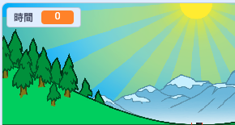
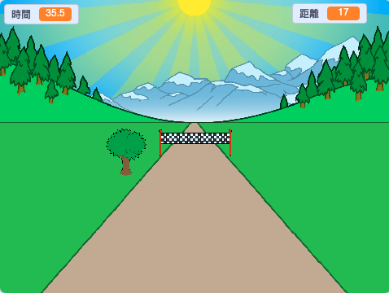

## 誰跑最快？

讓我們在的遊戲中添加一個計時器，看看誰可以跑得最快。

--- task ---

建立一個新的`時間`{:class="block3variables"}變數。 它會呈現在舞台上。 拖曳到左上角。



--- /task ---

--- task ---

在遊戲開始時將時間設置為0。


```blocks3
when green flag clicked
switch costume to (normal v)
set [distance v] to [0]
+ set [time v] to [0]
go to x: (0) y: (30)
set size to (1) %
```

--- /task ---

--- task ---

新增以下這些程式邏輯，可以讓你的計時器在遊戲開始時開始計時。


```blocks3
when I receive [start v]
forever
wait (0.1) seconds
change [time v] by (0.1)
end
```

--- /task ---

--- task ---

點擊綠旗測試你的程式。 你應該會看到計時器開始計時，直到完成100米衝刺。



--- /task ---

