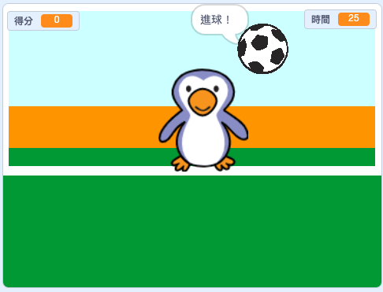

## 然後呢？

看看 [功夫足球](https://projects.raspberrypi.org/en/projects/beat-the-goalie) Scratch專案。

--- no-print ---

點擊綠旗開始。 使用左右方向鍵控制守門員。按<kbd>空白鍵</kbd> 來射門。

  <iframe allowtransparency="true" width="485" height="402" src="https://scratch.mit.edu/projects/embed/285942132/?autostart=false" frameborder="0" scrolling="no"></iframe>

--- /no-print ---

--- print-only ---

--- /print-only ---
